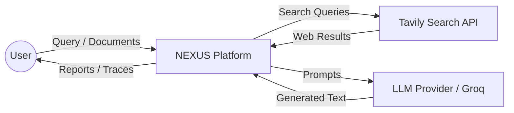
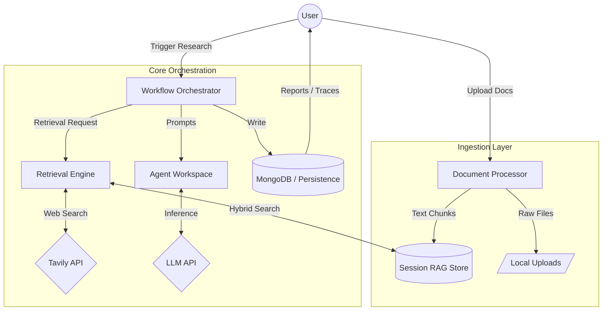
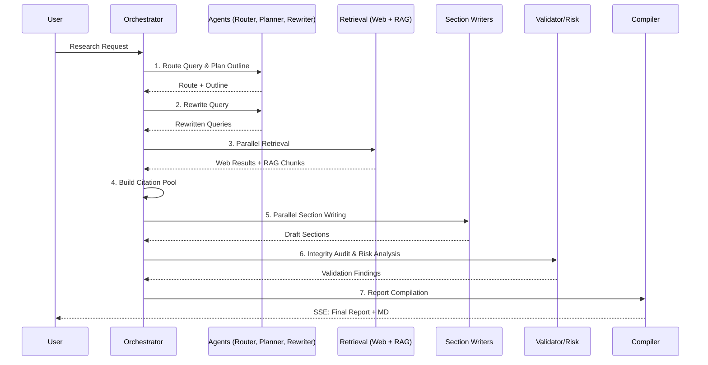

# NEXUS — System Design Document

This document outlines the technical architecture, data flows, and component interactions of the NEXUS AI Research Intelligence Platform.

---

## 1. System Architecture Overview

NEXUS is a multi-agent research platform designed to automate complex information gathering and report generation. It employs a decoupled architecture with a React-based frontend and a FastAPI-based backend, utilizing a staged multi-agent workflow for high-precision outputs.

### High-Level Architecture
- **Frontend**: Single Page Application (SPA) for orchestration, visualization, and report rendering.
- **Backend API**: RESTful endpoints and Server-Sent Events (SSE) for real-time progress tracking.
- **Workflow Orchestrator**: Manages the staged execution of specialized AI agents.
- **RAG Engine**: Session-scoped hybrid retrieval system (Vector + BM25).
- **Persistence Layer**: MongoDB for users, sessions, reports, and traces, with in-memory fallback for transient environments.

---

## 2. Tech Stack

| Layer | Technology |
|---|---|
| **Frontend** | React, Tailwind CSS, Lucide React, Vite |
| **Backend** | FastAPI, Python 3.10+, Pydantic |
| **AI/LLM** | Groq (Llama 3 / Mixtral), LangChain/Custom Orchestration |
| **Search API** | Tavily Search API |
| **Vector DB** | FAISS (In-memory, session-scoped) |
| **Text Search** | BM25 (Rank-BM25) |
| **Embeddings** | Sentence-Transformers (`all-MiniLM-L6-v2`) |
| **Database** | MongoDB (Motor Driver) |
| **Deployment** | Docker, Docker Compose |

---

## 3. Data Flow Diagrams (DFD)

### DFD Level 0: Context Diagram
Represents the system's relationship with external entities.



### DFD Level 1: System Process Overview
Detailed view of the internal processes and data stores.



### DFD Level 2: Multi-Agent Workflow Detail
Sequencing of agent interactions during a research session.



---

## 4. Component Breakdown

### 4.1. Backend Components

- **API Router (`app/api/routes.py`)**: Handles HTTP requests. `/research` initiates a streaming response where the orchestrator sends trace events and the final report.
- **Orchestrator (`app/workflows/orchestrator.py`)**: The central brain. Implements the staged pipeline:
    1. **Router**: Decides between WEB, RAG, or HYBRID mode.
    2. **Planner**: Generates a structured JSON outline.
    3. **Query Rewriter**: Optimizes the user query for search engines.
    4. **Section Writer**: Distributed writing of report chapters using relevant source subsets.
    5. **Validator**: Checks for hallucinations and source alignment.
- **RAG Store (`app/rag/retriever.py`)**: A transient, per-session FAISS index combined with BM25. It ensures document-grounded research without requiring a permanent vector database.
- **Parsers (`app/rag/parser.py`)**: Extracts text from PDF, DOCX, TXT, and MD. Supports OCR for image-heavy documents.

### 4.2. Frontend Components

- **State Management**: React `useState` and `useEffect` hooks manage the active research session, trace logs, and generated report content.
- **SSE Client**: Listens to the `/research` stream, updating the `TraceConsole` and `WorkflowPipeline` visualizer in real-time.
- **Report Renderer**: Converts the final JSON report into a rich, interactive UI with collapsible sections and clickable citations.
- **Source Inspector**: A slide-out panel that displays retrieval scores (vector vs. BM25) and raw chunk content for any cited source.

---

## 5. Data Models

### 5.1. Research Session
```json
{
  "session_id": "uuid",
  "username": "string",
  "metadata": {
    "files": ["list", "of", "filenames"],
    "last_report_id": "string"
  },
  "updated_at": "ISO8601"
}
```

### 5.2. Final Report
```json
{
  "id": "report_uuid",
  "title": "Report Title",
  "query": "Original Query",
  "sections": [
    {
      "title": "Section Title",
      "content": "Markdown content",
      "citations": [1, 2],
      "confidence_score": 0.95
    }
  ],
  "citations": [
    {
      "citation_id": 1,
      "source_name": "Source.pdf",
      "snippet": "..."
    }
  ],
  "metrics": {
    "total_latency_ms": 12400,
    "llm_calls": 12
  }
}
```

---

## 6. Security & Scalability

- **Authentication**: JWT-based stateless authentication.
- **Session Isolation**: RAG stores are isolated by `session_id`. In-memory FAISS indices are cleared upon session deletion or TTL expiry.
- **Concurrency**: Backend uses `asyncio` for parallel agent execution and non-blocking I/O.
- **Observability**: Every agent action is traced and stored in the database, allowing for full auditability of the AI's reasoning process.
